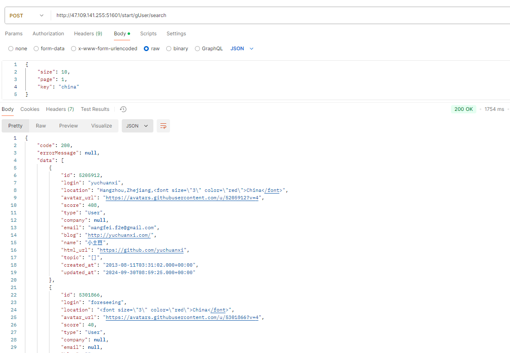

# 一. 项目介绍

GitGuru是一个GitHub数据应用，其主要功能为开发者评估，此项目致力于为所有使用本应用的用户提供交互友好的使用体验。本项目的主要功能如下：

- 登录校验：使用GitGuru的用户需要进行登录，若没有账号则可以进行注册。

- 加载GitHub数据：在GitGuru刚启动后，需要从GitHub请求一定量的数据，该数据的数量决定了之后用户技术等级评估的精确程度。

- 添加指定GitHub用户：若某用户未在GitGuru的数据库中，可以手动添加用户。

- 查找GitHub用户（领域查找）：GitGuru支持用户提供关键词来查询数据库中的GitHub用户，结果以用户技术等级降序排序。如.输入china则会显示所有与china有关的GitHub用户。

- 技术评估：GitGuru可以根据GitHub用户的粉丝数量，GitHub用户的项目重要程度（根据此人对该项目的贡献）等属性来进行技术评估。

- 猜测GitHub用户nation：有些开发者没有在简介中写明其所属国家/地区，GitGuru可以通过其工作时间、社交关系来推断其所属nation。

- 开发者技术能力评估信息自动整理：GitGuru可以通过用户的自我介绍以及用户最重要的一些项目的readme文档来归纳整理出用户的技术能力，以及技术特点。

  > 注：以上所有猜测的数据，若置信度不高，则会返回N/A。


### 项目分工

| 团队成员 | 主要工作                                                     |
| -------- | ------------------------------------------------------------ |
| 万欣     | 后端负责人：后端的架构设计、技术选型、具体接口实现、接口测试 |
| 黎汝星   | 前端负责人：https://github.com/Leonrx0/Developer-Assessments |


# 二. 功能演示

- 前端：https://www.bilibili.com/video/BV1WmBvYGEtV/?vd_source=87f3da7c5a6a611dc4cd4f324df29ee8


- 利用Xxl-Job定时任务更新用户分值演示视频：https://www.bilibili.com/video/BV1HoDSY1EBR/?vd_source=028657a849e866c70dc5d4bc19b98741


# 三. 项目启动准备（后端）

为了启动GitGuru的后端部分，需要进行以下准备：（推荐Linux）

- 准备一部内存大于4G的centos服务器。
- 下载docker，java8环境（网上很多教程）
- 使用docker下载Nacos1.2.0镜像，并根据以下命令创建容器（**记得打开服务器端口**，后面相似部分都得记得打开端口）

```
docker run --env MODE=standalone --name nacos --restart=always  -d -p 8848:8848 nacos/nacos-server:1.2.0
```

- 使用docker下载MySQL5.7（端口和密码可以修改）

```
docker run -p 7878:3306 --name mysql -v /mydata/mysql/log:/var/log/mysql -v /mydata/mysql/data:/var/lib/mysql -v /mydata/mysql/conf:/etc/mysql --restart=always -e MYSQL_ROOT_PASSWORD=123456 -d mysql:5.7
```

- 使用docker下载ElasticSearch7.12.1

```
docker run -d .--name es     -e "ES_JAVA_OPTS=-Xms512m -Xmx512m"     -e "discovery.type=single-node"     -v es-data:/usr/share/elasticsearch/data     -v es-plugins:/usr/share/elasticsearch/plugins     --privileged     --network es-net     -p 9200:9200     -p 9300:9300 elasticsearch:7.12.1
```

- 使用docker下载Kibana7.12.1（与ES版本要一致）

```
docker run -d --name kibana -e ELASTICSEARCH_HOSTS=http://es:9200 --network=es-net -p 5601:5601  kibana:7.12.1
```

- 使用docker下载redis（密码可自行修改）

```
docker run -d --name redis --restart=always -p 6379:6379 redis --requirepass "123456"
```

- 使用docker下载Xxl-Job2.3.0（自行修改中文部分）

```
docker run -e PARAMS="--spring.datasource.url=jdbc:mysql://服务器地址:服务器端口/xxl_job?Unicode=true&characterEncoding=UTF-8 \
--spring.datasource.username=root \
--spring.datasource.password=服务器密码" -p 8888:8080 -v /tmp:/data/applogs --name xxl-job-admin --restart=always  -d xuxueli/xxl-job-admin:2.3.0
```

- 下载zookeeper3.4.14

```
docker run -d --name zookeeper -p 2181:2181 zookeeper:3.4.14
```

- 下载Kafka2.12-2.3.1（自行修改中文部分）

```
docker run -d --name kafka --env KAFKA_ADVERTISED_HOST_NAME=服务器地址 --env KAFKA_ZOOKEEPER_CONNECT=服务器地址:2181 --env KAFKA_ADVERTISED_LISTENERS=PLAINTEXT://服务器地址:9092 --env KAFKA_LISTENERS=PLAINTEXT://0.0.0.0:9092 --env KAFKA_HEAP_OPTS="-Xmx256M -Xms256M" --net=host wurstmeister/kafka:2.12-2.3.1
```

- 用户需要注册kimi，获取Kimi API的token填入QNY -> QNY-utils -> GitHubUtils 37行。
- 用户需要注册GitHub API，获取token 填入 QNY -> QNY-utils -> GitHubUtils 35行。

**添加nacos配置：**

- QNY-start

```yaml
spring:
  kafka:
    bootstrap-servers: 服务器地址:9092
    producer:
      retries: 10
      key-serializer: org.apache.kafka.common.serialization.StringSerializer
      value-serializer: org.apache.kafka.common.serialization.StringSerializer
    consumer:
      group-id: ${spring.application.name}
      key-deserializer: org.apache.kafka.common.serialization.StringDeserializer
      value-deserializer: org.apache.kafka.common.serialization.StringDeserializer
  redis:
    host: 服务器地址
    password: 密码
    port: 6379
  elasticsearch:
    rest:
      uris: http://服务器地址:9200
      connection-timeout: 10s
      read-timeout: 10s
  datasource:
    driver-class-name: com.mysql.jdbc.Driver
    url: jdbc:mysql://服务器地址:端口/qny?useSSL=false&useUnicode=true&characterEncoding=UTF-8&serverTimezone=UTC
    username: root
    password: 密码
# 设置Mapper接口所对应的XML文件位置，如果你在Mapper接口中有自定义方法，需要进行该配置
mybatis-plus:
  mapper-locations: classpath*:mapper/*.xml
  # 设置别名包扫描路径，通过该属性可以给包中的类注册别名
  type-aliases-package: com.qny.model.start.pojos
xxl:
  job:
    admin:
      addresses: http://服务器地址:8888/xxl-job-admin
    executor:
      appname: qny-user-socre-executor
      port: 7777

```

> 修改上述中的中文内容

- QNY-gateway

```yaml
spring:
  cloud:
    gateway:
      globalcors:
        add-to-simple-url-handler-mapping: true
        corsConfigurations:
          '[/**]':
            allowedHeaders: "*"
            allowedOrigins: "*"
            allowedMethods:
              - GET
              - POST
              - DELETE
              - PUT
              - OPTION
      routes:
        # 平台管理
        - id: start
          uri: lb://QNY-start
          predicates:
            - Path=/start/**
          filters:
            - StripPrefix= 1
        - id: user
          uri: lb://QNY-user
          predicates:
            - Path=/user/**
          filters:
            - StripPrefix= 1
```

- QNY-user

```yaml
spring:
  datasource:
    driver-class-name: com.mysql.jdbc.Driver
    url: jdbc:mysql://服务器地址:端口/user?useSSL=false&useUnicode=true&characterEncoding=UTF-8&serverTimezone=UTC
    username: root
    password: 密码
# 设置Mapper接口所对应的XML文件位置，如果你在Mapper接口中有自定义方法，需要进行该配置
mybatis-plus:
  mapper-locations: classpath*:mapper/*.xml
  # 设置别名包扫描路径，通过该属性可以给包中的类注册别名
  type-aliases-package: com.qny.model.start.pojos


```

> 修改上述中的中文内容

- 利用maven讲源代码打成JAR包之后上传到服务器上运行


# 四. 详细实现（后端）

## 4.1 技术选型

- 主要语言：Java

- 微服务框架：SpringCloud

- 注册中心：Nacos

- 网关：Spring Cloud Gateway

- 数据库：MySQL

- ORM框架：MyBatis

- 中间件：Redis，Xxl-Job，Kafka，ElasticSearch

- 数据可视化：Kibana

- token生成：JWT

- 容器化技术：Docker

- 大模型云服务：Kimi

- 版本控制工具：Git

- 代理：Nginx

  ​


## 4.2 核心微服务

| 服务名称        | 主要功能                                                     |
| :-------------- | :----------------------------------------------------------- |
| QNY-gateway服务 | 所有向后端发送的请求都会在此处被拦截，gateway会去检查此次请求是否是请求那些受到保护的接口，若是则会检查是否携带token以及token是否合法 |
| QNY-user服务    | 负责GitGuru的登录注册，用户的密码会加上salt后进行MD5加密，存入数据库中，保护用户隐私。用户登录之后生成token用作后续全局校验。 |
| QNY-start       | GitGuru的主要服务，包含GitGuru的所有接口                     |

> 注：由于服务器内存限制，只拆分出三个服务，后续可以进行更加细粒度的拆分。


## 4.3 后端架构图


## 4.4 项目结构

```
QNY
├── QNY-common                  				// 此项目中未用来编写代码，只起到加载依赖作用
├── QNY-gateway   						// 网关
│   ├── QNY-app-gateway          
│   │   ├── filter   				 		// 拦截请求
│   │   ├── utils   						// JWT工具包
│   │   ├── QNYGatewayApplication.java 				// 入口 
├── QNY-model							// 存储实体类
│   ├── response						// 返回通用实体类
│   │   ├── AppHttpCodeEnum.java 				// 状态码和错误信息
│   │   ├── Response.java					// 实体类 
│   ├── start							// start服务所用实体类
│   │   ├── common						// 通用实体类 
│   │   ├── dto							// 传输 
│   │   ├── pojos						// 数据库实体类 
│   ├── user							// GitGuru用户实体类
│   │   ├── dtos						// 传输 
│   │   ├── pojos 						// 数据库实体类
├── QNY-service							// 存储所有的服务层代码
│   ├── QNY-start-service					// 主要服务
│   │   ├── config						// 配置
│   │   ├── controller			
│   │   ├── job							// xxl-job执行代码
│   │   ├── listener						// kafka
│   │   ├── mapper
│   │   ├── service						
│   │   ├── StartApplication					// 入口
│   ├── QNY-user-service					// GitGuru用户服务
├── QNY-test							// 测试
├── QNY-utils							// 存储工具类
│   ├── GitHubUtils						// 包括向GitHub API和Kimi接口发送请求（重要）
│   ├── AppJwtUtil.java						// JWT工具包

```


## 4.5 数据库以及ElasticSearch表设计

### 4.5.1 数据库设计

#### 4.5.1.1 user表（GitHub用户）

| 字段名称            | 类型     | 备注                             |
| ------------------- | -------- | -------------------------------- |
| id                  | int      | 主键                             |
| login               | varchar  | 请求api时所用名称                |
| node_id             | varchar  |                                  |
| avatar_url          | varchar  | 头像                             |
| url                 | varchar  | api地址                          |
| html_url            | varchar  | GitHub主页                       |
| followers_url       | varchar  | 粉丝api                          |
| following_url       | varchar  | 关注的人api                      |
| gists_url           | varchar  |                                  |
| starred_url         | varchar  |                                  |
| subscriptions_url   | varchar  | 订阅api                          |
| organizations_url   | varchar  | 组织api                          |
| repos_url           | varchar  | 仓库api                          |
| events_url          | varchar  | 事件api                          |
| received_events_url | varchar  | 收到的事件api                    |
| type                | varchar  | 账号类型（User or Organization） |
| user_view_type      | varchar  | 是否公开                         |
| site_admin          | varchar  | 是否是GitHub管理员               |
| gravatar_id         | varchar  |                                  |
| score               | double   | 技术得分                         |
| created_at          | datetime | 创建时间                         |
| updated_at          | datetime | 更新时间                         |

> 注：以上api指的是GitHub API


#### 4.5.1.2 user_info表（GitHub用户）

| 字段名称         | 类型     | 备注              |
| ---------------- | -------- | ----------------- |
| id               | int      | 主键              |
| login            | varchar  | 请求api时所用名称 |
| name             | varchar  | GitHub用户昵称    |
| company          | varchar  | 公司              |
| blog             | text     | blog url          |
| location         | varchar  | 归属地            |
| email            | varchar  | 邮箱              |
| bio              | varchar  | 自我描述          |
| twitter_username | varchar  | 推特名字          |
| public_repos     | int      | 公开仓库数量      |
| public_gists     | int      |                   |
| followers        | int      | 粉丝数            |
| following        | int      | 关注的人数量      |
| created_at       | datetime | 创建时间          |
| updated_at       | datetime | 更新时间          |
| topic            | varchar  | 技术领域          |

> 注：以上api指的是GitHub API


#### 4.5.1.3 user表（GitGuru用户）

| 字段名称     | 类型     | 备注                   |
| ------------ | -------- | ---------------------- |
| id           | int      | 主键                   |
| password     | int      | 通过MD5加密            |
| name         | varchar  | 名称                   |
| created_time | datetime | 创建时间               |
| status       | int      | 状态：1为正常，0为注销 |
| salt         | varchar  | 与MD5加密有关          |


### 4.5.2 ElasticSearch设计

存储GitHub用户信息

| 名称       | 是否使用分词器 | 备注                  |
| ---------- | -------------- | --------------------- |
| id         | 否             | 主键                  |
| login      | 否             | 请求api时所用名称     |
| location   | 是             | 归属地，copy to all   |
| avatar_url | 否             | 头像                  |
| score      | 否             | 技术分值              |
| type       | 否             | 用户类型              |
| company    | 是             | 公司，copy to all     |
| email      | 否             | 邮箱                  |
| blog       | 否             | blog url              |
| name       | 是             | 昵称，copy to all     |
| html_url   | 否             | GitHub主页地址        |
| topic      | 是             | 技术领域，copy to all |
| created_at | 否             | 创建时间              |
| updated_at | 否             | 更新时间              |
| all        | 是             | 用于查询              |

> 注：以上api指的是GitHub API


## 4.6 接口实现

### 4.6.1 GitHub API

GitGuru获取的所有GitHub数据都来自[GitHub API](https://docs.github.com/zh/rest)。


### 4.6.2 全局校验 + MD5加密

#### 4.6.2.1 全局校验（Gateway + JWT）


为了保护GitGuru的安全，除GitGuru用户登陆注册以外，其他接口都受到gateway的监控。收到监控的接口必须在请求中加入有效的token才能访问受保护的接口。***（流程图如上）***

JWT（JSON Web Token）是一种开放标准（RFC 7519），它定义了一种紧凑且自包含的方式，用于在各方之间以JSON对象的形式安全地传输信息。每个JWT都是经过数字签名的，因此可以被验证和信任。JWT可以使用秘密（使用HMAC算法）或使用RSA或ECDSA的公钥/私钥对进行签名。

token通过JWT技术生成，使用用户的id（主键）进行加密，过期时间设置为7天。***（token生成代码如下）***

```java
public static String getToken(Long id){
        Map<String, Object> claimMaps = new HashMap<>();
        claimMaps.put("id",id);
        long currentTime = System.currentTimeMillis();
        return Jwts.builder()
                .setId(UUID.randomUUID().toString())
                .setIssuedAt(new Date(currentTime))  //签发时间
                .setSubject("system")  //说明
                .setIssuer("heima") //签发者信息
                .setAudience("app")  //接收用户
                .compressWith(CompressionCodecs.GZIP)  //数据压缩方式
                .signWith(SignatureAlgorithm.HS512, generalKey()) //加密方式
                .setExpiration(new Date(currentTime + TOKEN_TIME_OUT * 1000))  //过期时间戳
                .addClaims(claimMaps) //cla信息
                .compact();
    }
```


#### 4.6.2.2 MD5加密

GitGuru为了保障用户密码隐私，用户的密码都是通过（password + salt）-> MD5加密存储到数据库中的。

```java
// salt
Integer i = random.nextInt(1000);
user.setSalt(i.toString());
String password = DigestUtils.md5DigestAsHex((dto.getPassword() + i).getBytes());
user.setPassword(password);
```


### 4.6.3 加载GitHub数据（Redis限制加载数量 + 分布式锁）


GitGuru有两种加载数据的方式，一种是手动添加，一种是利用Xxl-Job定时添加。
GitGuru是从GitHub API中得到数据的。但GitHub API存在一个限制，也就是一般用户只能**每小时请求5000次**。为了防止用户加载过多的用户，使得超过5000次这个阈值，GitGuru采用Redis进行限制，规定用户每小时只能存入不大于300个GitHub用户（由于加载GitHub用户的同时，还会去计算其技术得分和领域，所以每加载一个GitHub用户大致需要请求GitHub API10次，所以规定300这个限制）。其具体实现细节是，每次加载GitHub用户，会去扫描Redis中是否存在key  **`loadUserNums`** ，若存在，则会去判断其值加上此次的值是否超过300，若超过则不能加载，若没超过则更新value，同时保持过期时间不变。若没有这个key，则会去存入这个key对应当前加载数量的value，设置过期时间为1h。***（如下图）***


```java
try {
    for (int i = 0; i < page; i++) {
        Random random = new Random();
        // 获取随机起点
        int randomInt = random.nextInt(USER_MAX_NUM);

        String url = "https://api.github.com/users?repos>0&since=" + randomInt + "&per_page=" + pageSize;
        Callable<List<User>> task = () -> JSON.parseArray(request(url), User.class);
        Future<List<User>> future = executor.submit(task);
        userList.addAll(future.get());
    }
}
```

当用户需要存上百的GitHub用户时，由于会同时计算其技术得分（在4.5.4会详细解释如何计算）和领域，导致请求时间很慢。为此，我采取了多线程加速（经实验，提速3倍）。但引入线程又会引发线程问题：由于GitGuru向GitHub API获取用户时，采取的是随机起点***（如上述代码）***。所以会存在同时插入相同的GitHub用户的问题，导致向数据库中插入相同的数据。为此我采用了分布式锁技术。


其具体实现思路：获取和计算某GitHub用户时，尝试去获取Redis中是否有  **`User + userId + _lock `**这样的key***（如上图）***，若有则说明当前GitHub用户以及被某线程执行了，若没有则向Redis存入次key，过期时间设置为5s。***（加锁代码如下）***。

```java
/**
     * 加锁（redis）
     * @param name
     * @param expire
     * @return
     */
    public String tryLock(String name, long expire) {
        name = name + "_lock";
        String token = UUID.randomUUID().toString();
        RedisConnectionFactory factory = stringRedisTemplate.getConnectionFactory();
        RedisConnection conn = factory.getConnection();
        try {
            //参考redis命令：
            //set key value [EX seconds] [PX milliseconds] [NX|XX]
            Boolean result = conn.set(
                    name.getBytes(),
                    token.getBytes(),
                    Expiration.from(expire, TimeUnit.MILLISECONDS),
                    RedisStringCommands.SetOption.SET_IF_ABSENT //NX
            );
            if (result != null && result)
                return token;
        } finally {
            RedisConnectionUtils.releaseConnection(conn, factory,false);
        }
        return null;
    }
```


### 4.6.4 用户技术领域计算和ElasticSearch存储

#### 4.6.4.1 用户技术领域计算


GitGuru提供了领域查询，用户可以提供具体的关键字去查找某领域的用户（如：输入Java，展示Java领域的用户）。此领域GitHub没有直接提供给我们，那么应该如何获取呢？我们发现，每个用户的仓库里会存在此仓库的topic，这个topic一定程度上代表了用户擅长的领域。所以GitGuru会去轮询某个用户的仓库。计算出每个用户出现次数最多的5个领域***（如下图）***，然后存入到数据库和ES中。


#### 4.6.4.2 ElasticSearch存储（Kafka）

在加载数据和定时更新技术得分（4.5.6详细介绍）操作ES时，为了提高效率以及解耦，GitGuru考虑用MQ来更新ES。又因为Kafka有着追求高吞吐量，适合产生大量数据的互联网服务的数据收集业务的特点，所以引入了Kafka这个中间件作为MQ。

eg.加载数据：

```java
@Component
@Slf4j
public class SyncGitHubUserListener {

    @Autowired
    private RestHighLevelClient restHighLevelClient;

    @KafkaListener(topics = "es.sync.topic")
    public void onMessage(String message) {
        if (StringUtils.isNotBlank(message)) {
            log.info("SyncArticleListener, message = {}", message);

            UserES userES = JSON.parseObject(message, UserES.class);

            IndexRequest request = new IndexRequest("user").id(userES.getId().toString());
            request.source(message, XContentType.JSON);

            try {
                restHighLevelClient.index(request, RequestOptions.DEFAULT);
            } catch (Exception e) {
                e.printStackTrace();
                log.error("sync es error = {}", e);
            }
        }
    }
}
```

更新得分与上述相似。


### 4.6.5 用户技术评估

GitGuru从GitHub API得到的数据中发现，一个用户的技术可以由粉丝数量，仓库数量，仓库的重要程度（由Start数，Watch数，Fork数，Issue数，项目创建的时间组成），以及用户对某个仓库的贡献度共同决定。

由此GitGuru提出了用户技术得分的计算公式：


> 其中wi是人为设置的参数，代表该项的重要程度
>
> 贡献占比 = 自己对此项目的贡献分 / 所有人对此项目的贡献分

其单个仓库评分计算代码如下：

```java
/**
 * 给定仓库和用户名，获得分值
 * @param repo
 * @param userName
 * @return
 */
private static int getRepoScore(Repos repo, String userName) {
    int stargazersCount = repo.getStargazers_count();
    int forksCount = repo.getForks_count();
    int openIssuesCount = repo.getOpen_issues_count();
    int watchersCount = repo.getWatchers_count();
    double time = repo.getUpdatedAt().getTime() / 1e12;

    String contributorsUrl = repo.getContributors_url();

    // 获取所有人的贡献
    String r = request(contributorsUrl);

    if (!StringUtils.isNotBlank(r)) return 0;

    // 自己的贡献分
    int my_w = 0;
    // 所有人对此项目的贡献分
    int sum_w = 0;
    for (Contributors contributors : JSON.parseArray(r, Contributors.class)) {
        // 如果轮询到自己了
        if (StringUtils.equals(contributors.getLogin(), userName)) my_w = contributors.getContributions();
        sum_w += contributors.getContributions();
    }

    if (sum_w == 0 || my_w == 0) return 0;
    // 该用户在这个仓库中的贡献占比
    int w = my_w / sum_w;

    // 分值计算公式
    return (int) ((stargazersCount * S_STAR_W + forksCount * S_FORK_W + openIssuesCount * S_ISSUE_W + watchersCount * S_WATCHER_W) * time * w);
}
```

GitGuru最后通过将所有得分超过0的GitHub用户进行降序排序，取前1%的GitHub用户为S级，前10%的GitHub用户为A级，前30%的GitHub用户为B级，前70%的GitHub用户为C级，其余GitHub用户GitGuru认为其评分的置信度不足，故设置为N/A。


### 4.6.6 领域搜索（ElasticSearch）

GitGuru允许用户根据一些关键词进行领域搜索，如Location、Topic（如Java）、name（用户的昵称）、company。此功能是由ElasticSearch实现的。

ElasticSearch是一款非常强大的开源搜索引擎，具备非常多强大功能，可以帮助我们从海量数据中快速找到需要的内容。通过将需要查询的字段进行分词，进行倒排索引，可以大大提高搜索的效率。


如上图，给定key，ES可以帮你找出与该key最有关的数据。并且GitGuru提供了**高亮显示**，与关键词相同的字会被高亮，显示为红色。并且所有查询出来的结果都会根据技术得分Score进行倒序排序。


### 4.6.7 定时更新用户分值（Xxl-Job）

由于用户的技术不是一成不变的，随着时间的积累，用户的技术也会得到提升。因此GitGuru会定时的去更新GitHub用户的技术得分（注：由于一些用户可能很久没有活跃过了，那么再去更新其得分会浪费很多资源，故GitGuru只会去更新最活跃的前300个用户）。此定时任务使用Xxl-Job来完成。

Xxl-Job是一个轻量级分布式任务调度平台。Xxl-Job以其轻量级、易扩展和开箱即用的特点，成为了许多公司分布式任务调度的首选解决方案。

GitGuru设定其更新时间：每周一凌晨4点更新。其Corn表达式：0 0 4 ? * 1。

其代码地址：QNY -> QNY-start-service -> job -> ComputeUserScoreJob.java

其任务配置如下：


> 注：更新策略与4.5.5一致


### 4.6.8 猜测GitHub用户nation（Kimi）

从GitHub API获取的GitHub用户，有一些没有设置其location，GitGuru提供了猜测GitHub用户nation的功能。

其具体实现思路：

- 从GitHub用户的event中，得到用户的工作时间，而获取的工作时间在一定程度上可以得到其时区信息。
	 从GitHub用户关注的人和粉丝中，轮询得到其所有出现的location，该数据里可以获得GitHub用户一定的   	nation信息。
- 从用户的昵称入手，用户的昵称一般都是使用其本国语言，可以从中获得一定的信息。

得到了上述三条信息之后，提交给Kimi，让其进行推理，返回推理理由和推理结果（**其代码地址为QNY->QNY-utils->GitHubUtils.java->getUserLocations1()（第283行）**）。并设置好提示词：如果推理的结果可信度不高，则返回N/A。示例如下：

```json
{
    "code": 200,
    "errorMessage": "操作成功",
    "data": {
        "userLocations": "推断理由：\n1. 用户的工作时间记录显示了多个时间点，我们可以从中推断出用户的时区。工作时间记录中最早的时间是2024-10-04T09:51:34Z，这表明用户在UTC时间09:51:34工作，而最晚的时间是2024-10-04T10:02:50Z，表明用户在UTC时间10:02:50工作。这表明用户可能处于UTC+1时区，因为这些时间点在西班牙的工作时间范围内。\n\n2. 用户关注的人的居住地数量显示，西班牙（Spain）有3个，安达卢西亚（Andalusia）有1个，格拉纳达（Granada）有2个，马拉加（Malaga）有1个，这些地区都在西班牙。这表明用户可能与西班牙有较强的社交联系。\n\n3. 用户粉丝的居住地数量显示，西班牙（Spain）有4个，巴塞罗那（Barcelona）有2个，格拉纳达（Granada）有1个，马拉加（Malaga）有1个，这些地区同样都在西班牙。这进一步强化了用户与西班牙的社交联系。\n\n4. 用户的GitHub名字是José M. Alarcón，这是一个典型的西班牙名字。\n\n综合以上信息，我们可以推断该GitHub用户最有可能的国籍是西班牙。\n\n结果：西班牙"
    }
}
```

可以看到Kimi综合了用户的时区信息，社交关系，和昵称，从而得到了西班牙这个结果。***（代码如下）***

```java
/**
     * 通过用户的工作时间（从中得到时区），以及用户的社交关系，利用类chatGPT软件推理
     * @param userName
     * @return
     */
    public static String getUserLocations1(String userName) {
        String httpsUrlFollowers = "https://api.github.com/users/" + userName + "/followers";
        String httpsUrlFollowing = "https://api.github.com/users/" + userName + "/following";
        ExecutorService executor = Executors.newFixedThreadPool(THREAD_NUM);
        // 线程池，个数可选
        Callable<List<User>> followersTask = () -> JSON.parseArray(request(httpsUrlFollowers), User.class);
        Callable<List<User>> followingTask = () -> JSON.parseArray(request(httpsUrlFollowing), User.class);

        try {
            Future<List<User>> followersFuture = executor.submit(followersTask);
            Future<List<User>> followingFuture = executor.submit(followingTask);

            List<User> followers = followersFuture.get();
            List<User> following = followingFuture.get();

            Map<String, Integer> locationCount1 = new HashMap<>();
            Map<String, Integer> locationCount2 = new HashMap<>();

            if (followers != null) {
                for (User user : followers) {
                    executor.submit((Callable<Void>) () -> {
                        processUser(user, locationCount1, 1);
                        return null;
                    });
                }

            }

            if (following != null) {
                for (User user : following) {
                    executor.submit((Callable<Void>) () -> {
                        processUser(user, locationCount2, 1);
                        return null;
                    });
                }
            }

            // 等待线程关闭
            executor.shutdown();
            if (!executor.awaitTermination(300, TimeUnit.SECONDS)) {
                executor.shutdownNow();
            }

            String json = "https://api.github.com/users/" + userName + "/events";
            String request = request(json);

            List<Events> events = JSON.parseArray(request, Events.class);

            List<String> dateList = new ArrayList<>();
            if (events != null) {
                for (Events event : events) {
                    String createdAt = event.getCreatedAt();
                    String updatedAt = event.getUpdatedAt();
                    if (StringUtils.isNotBlank(createdAt)) dateList.add(createdAt);
                    if (StringUtils.isNotBlank(updatedAt)) dateList.add(updatedAt);
                }
            }

            // 置信度太低
            if (locationCount1.size() < 5 && locationCount2.size() < 3) return "N/A";

            UserDto userDto = getUserInfo(userName);

            KimiDto kimiDto = new KimiDto();
            kimiDto.setModel("moonshot-v1-auto");

            List<KimiMessage> list = new ArrayList<>();

            // 构建问题
            KimiMessage kimiMessage1 = new KimiMessage();
            kimiMessage1.setRole("user");
            kimiMessage1.setContent("用户的工作时间记录：" + dateList);
            list.add(kimiMessage1);

            KimiMessage kimiMessage2 = new KimiMessage();
            kimiMessage2.setRole("user");
            kimiMessage2.setContent("用户关注的人的居住地数量：" + locationCount2);
            list.add(kimiMessage2);

            KimiMessage kimiMessage3 = new KimiMessage();
            kimiMessage3.setRole("user");
            kimiMessage3.setContent("用户粉丝的居住地数量：" + locationCount1);
            list.add(kimiMessage3);

            if (userDto != null) {
                if (StringUtils.isNotBlank(userDto.getName())) {
                    KimiMessage kimiMessage4 = new KimiMessage();
                    kimiMessage4.setRole("user");
                    kimiMessage4.setContent("用户的github名字：" + userDto.getName());
                    list.add(kimiMessage4);
                }
            }

            KimiMessage kimiMessage6 = new KimiMessage();
            kimiMessage6.setRole("user");
            kimiMessage6.setContent("请根据用户的工作时间（从中获得时区），用户的社交关系，用户的名字（如果存在）推断该github用户最有可能的国籍，只需要显示推断理由和结果，若置信度过低则返回N/A");
            list.add(kimiMessage6);

            kimiDto.setMessages(list);

            // 询问类chatgpt应用 该用户属于哪个国家
            String s = request_kimi(JSON.toJSONString(kimiDto));

            String mostFrequentLocation = "";

            ChatCompletionResponse chatCompletionResponse = JSON.parseObject(s, ChatCompletionResponse.class);

            if (chatCompletionResponse == null) return "N/A";

            for (ChatCompletionResponse.Choice choice : chatCompletionResponse.getChoices()) {
                mostFrequentLocation = choice.getMessage().getContent();
            }

            return mostFrequentLocation;
        } catch (Exception e) {
            e.printStackTrace(); // 更详细的异常信息
            throw new RuntimeException(e);
        }
    }
```


Kimi是北京月之暗面科技有限于2023年10月9日推出的一款智能助手，主要应用场景为专业学术论文的翻译和理解、辅助分析法律问题、快速理解API开发文档等，是全球首个支持输入20万汉字的智能助手产品。


### 4.6.9 开发者技术能力评估信息自动整理（Kimi）

GitGuru可以根据给定的GitHub用户去提取整理其技术能力评估信息，返回其技术特点。

其具体实现思路：

- 有一些GitHub用户在个人信息中有本身账号的相关介绍，我们可以提取出其信息。
- 从GitHub用户技术含量最高的三个项目入手。提取其README文件（注意：从GitHub API得到的README信息是通过base64编码的，所以需要进行解码）。

通过上述得到的信息，将其输入给Kimi，让其整理出该用户的技术特点（**其代码地址为QNY->QNY-utils->GitHubUtils.java->getKimiEvaluate()（第556行）**）。实例如下：

```json
{
    "code": 200,
    "errorMessage": "操作成功",
    "data": "根据您提供的用户介绍和几个项目的README文件，我们可以总结出以下技术特点：\n\n1. **插件开发**：用户被称为“Vim plugin artist”，表明他在Vim插件开发方面具有专业技能和创造力。\n\n2. **自动化和效率**：通过开发如`heroku-fucking-console`、`hookup`和`gem-ctags`等工具，用户展示了对自动化和提高开发效率的重视。这些工具旨在简化日常开发任务，如Heroku命令行交互、Rails项目的版本控制和依赖管理，以及RubyGems的自动索引。\n\n3. **对现有工具的改进**：用户不满足于现有工具的限制，通过开发插件和工具来扩展和增强它们的功能。例如，`heroku-fucking-console`是对Heroku命令行工具的增强，提供了更灵活的控制台访问。\n\n4. **跨语言支持**：用户的工具支持多种编程语言和环境，如Ruby、Clojure等，显示了他在不同技术栈中的广泛知识和应用能力。\n\n5. **开源贡献**：用户通过GitHub分享他的工作，这表明他积极参与开源社区，愿意贡献自己的代码以帮助他人。\n\n6. **对Vim的深入理解**：用户开发的Vim插件显示了他对Vim编辑器的深入理解和熟练使用，这是许多高级开发者的共同特点。\n\n7. **对命令行工具的偏好**：用户开发的多个工具都是基于命令行的，这表明他倾向于使用和改进命令行工具来提高工作效率。\n\n8. **代码风格和质量**：用户在贡献指南中提到了对丑陋提交信息的零容忍政策，这表明他重视代码的风格和质量。\n\n9. **MIT License**：用户的作品通常使用MIT License，这是一种宽松的开源许可证，允许他人自由使用、复制、修改和分发代码，这进一步证明了他对开源社区的贡献。\n\n综上所述，用户是一位专注于提高开发效率、具有跨语言能力、对Vim有深入了解、偏好命令行工具、重视代码质量和风格的Vim插件开发者。"
}
```

可以看到，Kimi根据其个人描述，以及其项目的介绍，整理出了该用户的技术能力评估信息。***（代码如下）***

```java
/**
 * 通过AI阅读该用户start最高的五个项目的readme之后，得到对该用户的技术总结
 * @param userName
 * @return
 */
public static String getKimiEvaluate(String userName) {
    // 获得该用户的全部仓库
    List<Repos> repos = getRepo(userName);

    if (repos == null) return null;
	
    // 获取GitHub用户信息
    UserDto userInfo = getUserInfo(userName);

    // 取出star值最高的五个项目
    List<Repos> collect = repos.stream().sorted(Comparator.comparingInt(Repos::getStargazers_count).reversed())
            .limit(5)
            .collect(Collectors.toList());

    KimiDto kimiDto = new KimiDto();
    kimiDto.setModel("moonshot-v1-auto");

    List<KimiMessage> kimiMessageList = new ArrayList<>();

    if (userInfo != null && StringUtils.isNotBlank(userInfo.getBio())) {
        KimiMessage message = new KimiMessage();
        message.setRole("user");
        message.setContent("用户介绍：" + userInfo.getBio() + "，需要将此介绍也输出出来");
        kimiMessageList.add(message);
    }

    for (Repos repo : collect) {
        String repoName = repo.getName();
        String url = "https://api.github.com/repos/" + userName + "/" + repoName + "/contents/";
        String request = request(url);

        List<GitHubContent> gitHubContents = JSON.parseArray(request, GitHubContent.class);

        if (gitHubContents == null) continue;

        url = "";

        for (GitHubContent gitHubContent : gitHubContents) {
            String gitHubContentUrl = gitHubContent.getUrl();
            if (gitHubContentUrl.contains("README") || gitHubContentUrl.contains("readme")) url = gitHubContentUrl;
        }

        if (!StringUtils.isNotBlank(url)) continue;

        request = request(url);

        GitHubRepoFile gitHubRepoFile = JSON.parseObject(request, GitHubRepoFile.class);

        if (gitHubRepoFile == null) continue;

        // 获取readme内容
        String content = gitHubRepoFile.getContent();

        if (!StringUtils.isNotBlank(content)) continue;

        // base64解码
        String s = base64(content);

        KimiMessage kimiMessage = new KimiMessage();
        kimiMessage.setContent(s);
        kimiMessage.setRole("user");
        kimiMessageList.add(kimiMessage);
    }

    KimiMessage kimiMessage = new KimiMessage();
    kimiMessage.setRole("user");
    kimiMessage.setContent("请根据用户介绍（如果存在）和他的一些作品的readme文件，简要介绍作者的技术特点");
    kimiMessageList.add(kimiMessage);

    kimiDto.setMessages(kimiMessageList);

    String jsonString = JSON.toJSONString(kimiDto);

    return request_kimi(jsonString);
}

/**
 * base64解码
 * @param base64EncodedString
 * @return
 */
public static String base64(String base64EncodedString) {
    // 清理字符串，移除任何非法Base64字符
    String cleanedString = base64EncodedString
            .replace("\n", "")
            .replace("\r", "")
            .replace(" ", "");

    try {
        // 尝试使用标准Base64解码器解码
        byte[] decodedBytes = Base64.getDecoder().decode(cleanedString);
        return new String(decodedBytes);
    } catch (IllegalArgumentException e) {
        // 如果标准解码器失败，尝试URL安全的解码器
        try {
            byte[] decodedBytes = Base64.getUrlDecoder().decode(cleanedString);
            return new String(decodedBytes);
        } catch (IllegalArgumentException ex) {
            ex.printStackTrace();
            return null;
        }
    }
}
```


## 五. API测试

### 5.1 GitGuru登陆注册测试

- 登录：成功


- 登录：密码错误


- 登录：数据不存在


- 注册：数据已经存在


- 注册：成功


### 5.2 加载GitHub数据测试

- 不带token（未登录）


- 加载超过300条数据


- 当本小时已经插入了200又新插入200条数据


- 插入成功


### 5.3 领域查找测试

- 不带token


- 查找topic成功


- 查找nation成功




### 5.4 猜测GitHub用户nation测试

- 不带token


- 猜测成功


- 猜测置信度不高（用户社交网络过于简单），返回N/A


- 猜测置信度不高（由Kimi判定）


- 没有此用户


### 5.5 开发者技术评估信息自动整理测试

- 不带token


- 整理成功


- 没有此用户


### 5.6 定时计算技术得分

- 测试按钮（Xxl-Job界面）


- 测试结果


